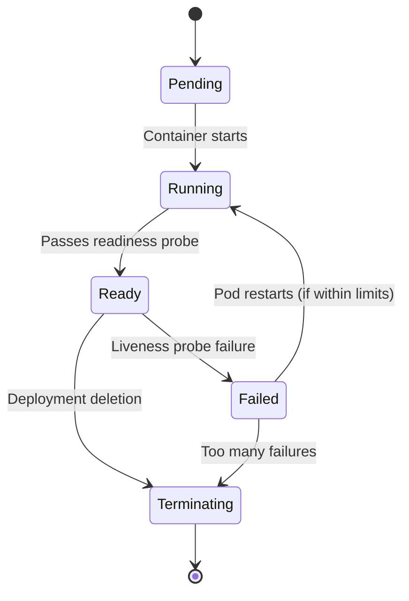

# Data Model: Local Kubernetes Deployment

**Feature**: 004-kubernetes-deployment
**Date**: 2026-01-05

## Overview

Entity and relationship definitions for Kubernetes deployment infrastructure.

---

## Entities

### 1. Container Image

**Description**: A packaged application artifact containing application code, runtime dependencies, and configuration for deployment to Kubernetes.

**Attributes**:
- name: Container image identifier (e.g., "todo-frontend", "todo-backend")
- tag: Version identifier (e.g., "local", "v1.0.0", "latest")
- registry: Container registry location (e.g., local Docker daemon, Docker Hub)
- baseImage: Foundation image used in multi-stage build (e.g., "node:20-alpine", "python:3.13-slim")
- size: Final image size in bytes/megabytes
- buildStage: Current build phase (builder or runner)
- platforms: Supported CPU architectures (amd64, arm64)

**Relationships**:
- Many-to-One: Container Image → Deployment Package (images referenced by chart values)
- One-to-Many: Container Image → Service Instance (multiple pods may run same image)

---

### 2. Service Instance (Kubernetes Pod)

**Description**: One or more running containers in Kubernetes cluster with resource limits, health probes, and lifecycle state.

**Attributes**:
- name: Service instance identifier (e.g., "todo-app-frontend-123456")
- namespace: Kubernetes namespace isolation
- deploymentName: Parent deployment reference
- replicaIndex: Replica number in deployment (1, 2, 3, etc.)
- phase: Lifecycle phase (Pending, Running, Ready, Terminating, Failed)
- restartCount: Number of restarts
- age: Time since pod creation
- resourceUsage: Current CPU/memory consumption
- healthStatus: Result of health probes (Healthy, Unhealthy)

**Relationships**:
- Many-to-One: Service Instance → Deployment (managed by deployment spec)
- One-to-Many: Service Instance → Health Check (probes configured for instance)
- Many-to-One: Service Instance → Network Service (exposed via service)
- Many-to-One: Service Instance → Credential Storage (secrets injected as env vars)
- Many-to-One: Service Instance → Configuration Storage (config mounted as env vars)

---

### 3. Network Service

**Description**: Kubernetes service abstraction that defines network access policy for reaching pods. Can be external (NodePort, LoadBalancer) or internal (ClusterIP).

**Attributes**:
- name: Service resource name (e.g., "todo-app-frontend", "todo-app-backend")
- type: Service type (NodePort, ClusterIP, LoadBalancer, ExternalName)
- port: Service port (internal access)
- targetPort: Container port being exposed
- nodePort: Port on host node (NodePort services only)
- clusterIP: Internal IP (ClusterIP services only)
- externalIP: External IP (LoadBalancer services only)
- selector: Label selector to match pods
- sessionAffinity: Sticky session policy (None, ClientIP)

**Relationships**:
- One-to-Many: Network Service → Service Instance (routes traffic to matching pods)
- Many-to-One: Network Service → Deployment (created by deployment package)
- One-to-Many: Network Service → Deployment Package (generated by chart templates)

---

### 4. Deployment

**Description**: Declarative Kubernetes resource that manages Service Instance lifecycle, including replica count, update strategy, and pod template specification.

**Attributes**:
- name: Deployment resource name
- namespace: Kubernetes namespace
- replicaCount: Desired number of instances
- strategyType: Update strategy (RollingUpdate, Recreate)
- maxSurge: Maximum number of extra instances during update
- maxUnavailable: Maximum number of unavailable instances during update
- revisionHistory: List of deployment revisions for rollback

**Relationships**:
- One-to-Many: Deployment → Service Instance (manages instance lifecycle)
- Many-to-One: Deployment → Deployment Package (generated by chart)
- Many-to-One: Deployment → Network Service (creates services for instances)

---

### 5. Deployment Package (Helm Chart)

**Description**: Collection of Kubernetes templates and configuration values that generate deployable manifests. Encapsulates all deployment infrastructure for application.

**Attributes**:
- name: Chart name (e.g., "todo-app")
- version: Chart semantic version (e.g., "1.0.0")
- appVersion: Application semantic version (e.g., "1.0.0")
- description: Chart description
- type: Package type (application, library)
- keywords: Search keywords
- maintainers: Maintainer information
- templates: List of template files
- values: Default configuration values
- apiVersion: Helm API version

**Relationships**:
- Many-to-One: Deployment Package → Deployment (generates deployment manifests)
- Many-to-One: Deployment Package → Network Service (generates service manifests)
- Many-to-One: Deployment Package → Credential Storage (generates secret manifests)
- Many-to-One: Deployment Package → Configuration Storage (generates configmap manifests)
- Many-to-One: Deployment Package → Container Image (references images by name:tag)

---

### 6. Credential Storage (Kubernetes Secret)

**Description**: Secure storage for sensitive data (API keys, database connection strings) encoded in base64 and injected into pods as environment variables.

**Attributes**:
- name: Secret resource name (e.g., "todo-secrets")
- namespace: Kubernetes namespace
- type: Secret type (Opaque, TLS, ServiceAccount)
- data: Key-value pairs (base64 encoded values)
- creationTimestamp: When secret was created
- version: Secret version for rolling updates

**Relationships**:
- One-to-Many: Credential Storage → Service Instance (injected as env vars)
- Many-to-One: Credential Storage → Deployment Package (generated by chart)

---

### 7. Configuration Storage (ConfigMap)

**Description**: Key-value configuration storage for non-sensitive data mounted as environment variables in pods.

**Attributes**:
- name: ConfigMap resource name (e.g., "todo-config")
- namespace: Kubernetes namespace
- data: Key-value pairs (plaintext values)
- creationTimestamp: When ConfigMap was created
- version: ConfigMap version for rolling updates

**Relationships**:
- One-to-Many: Configuration Storage → Service Instance (mounted as env vars)
- Many-to-One: Configuration Storage → Deployment Package (generated by chart)

---

### 8. Health Check (Kubernetes Probe)

**Description**: Health probes (liveness and readiness) that monitor pod health and determine traffic routing.

**Attributes**:
- type: Probe type (liveness, readiness, startup)
- probeType: Probe mechanism (HTTPGet, TCPSocket, Exec)
- path: HTTP path or command
- port: Target port
- initialDelaySeconds: Delay before first probe
- periodSeconds: Probe interval
- timeoutSeconds: Probe timeout
- successThreshold: Consecutive successes to be healthy
- failureThreshold: Consecutive failures to restart pod

**Relationships**:
- Many-to-One: Health Check → Service Instance (configured for instance)
- Many-to-One: Health Check → Deployment (specified in deployment spec)

---

## State Transitions

### Service Instance Lifecycle



**States**:
- **Pending**: Pod created but not yet scheduled
- **Running**: Pod is running, may not be ready yet
- **Ready**: Pod passes readiness probes, can receive traffic
- **Failed**: Pod has failed and will be restarted or deleted
- **Terating**: Pod is being removed from cluster

**Transition Triggers**:
- **Pending → Running**: Node resources available, container image pulled
- **Running → Ready**: Readiness probe succeeds
- **Ready → Failed**: Liveness probe fails repeatedly
- **Failed → Running**: Restarted by Kubernetes
- **Ready → Failed → Terminating**: Too many restarts ( CrashLoopBackOff)
- **Ready → Terminating**: Deployment deletion or scale-down
- **Terating → [*]: Pod completely removed

---

## Entity Relationships Summary

```
Deployment Package (Helm Chart)
    ├─→ Deployment (Kubernetes resource)
    │     └─→ Service Instance (Pod) [1..N replicas]
    │           ├─→ Network Service (access)
    │           ├─→ Credential Storage (Secrets)
    │           ├─→ Configuration Storage (ConfigMap)
    │           └─→ Health Check (Probes)
    └─→ Container Image (referenced by tag)
```

---

## Validation Rules

### Container Image
- Size must be <500MB (frontend) or <300MB (backend)
- Must use non-root user for security
- Base image must be minimal (Alpine/slim)

### Service Instance
- Must have resource requests and limits defined
- Must have both liveness and readiness probes
- Must reference valid container image

### Network Service
- Must have selector matching deployment pods
- Must expose appropriate port for access type

### Deployment
- Must have RollingUpdate strategy for zero downtime
- Must specify maxSurge and maxUnavailable

### Credential Storage
- Must use base64 encoding for values
- Must not include sensitive data in plain text

### Configuration Storage
- Must use plaintext values
- Must not include sensitive data

---

## Constraints

- Service instances are stateless by design
- All state persistence handled externally (Neon PostgreSQL)
- Health checks use HTTP probes
- Rolling updates maintain availability
- Secrets are not logged to console
